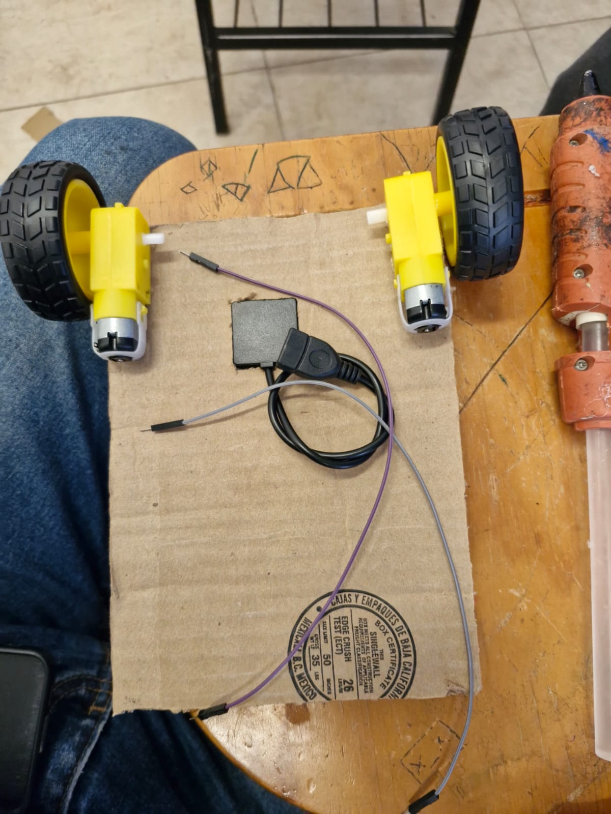
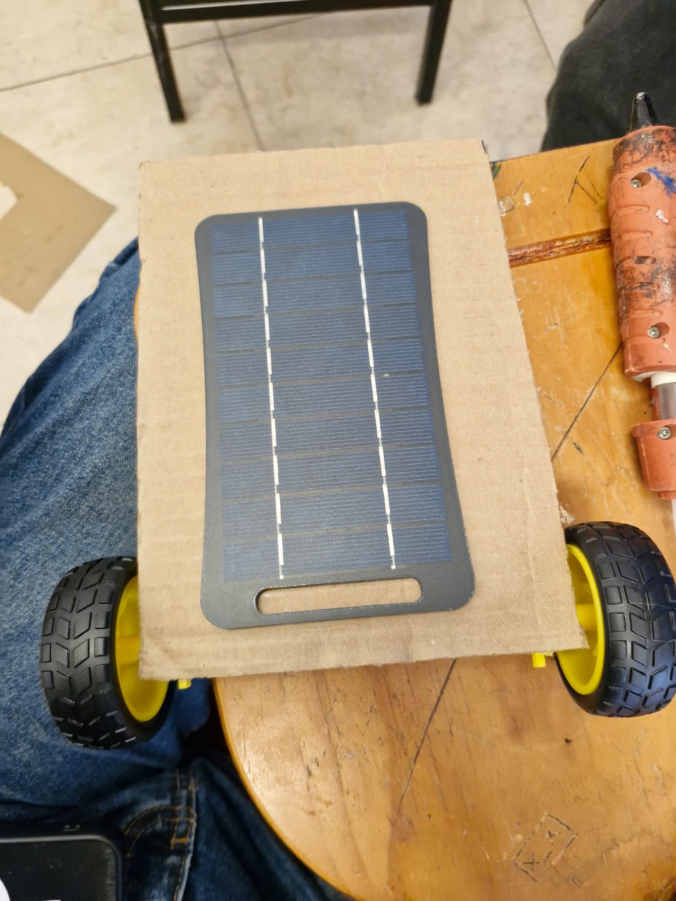
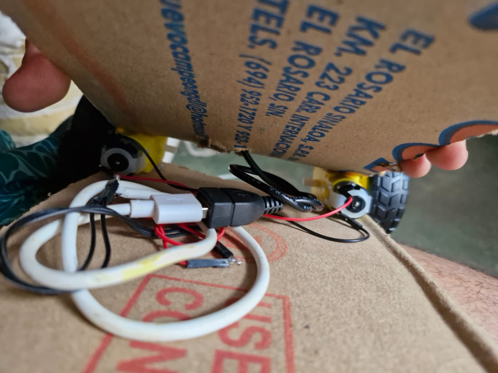
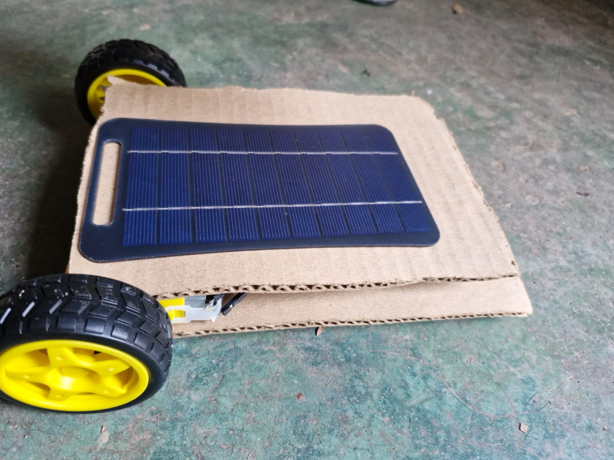
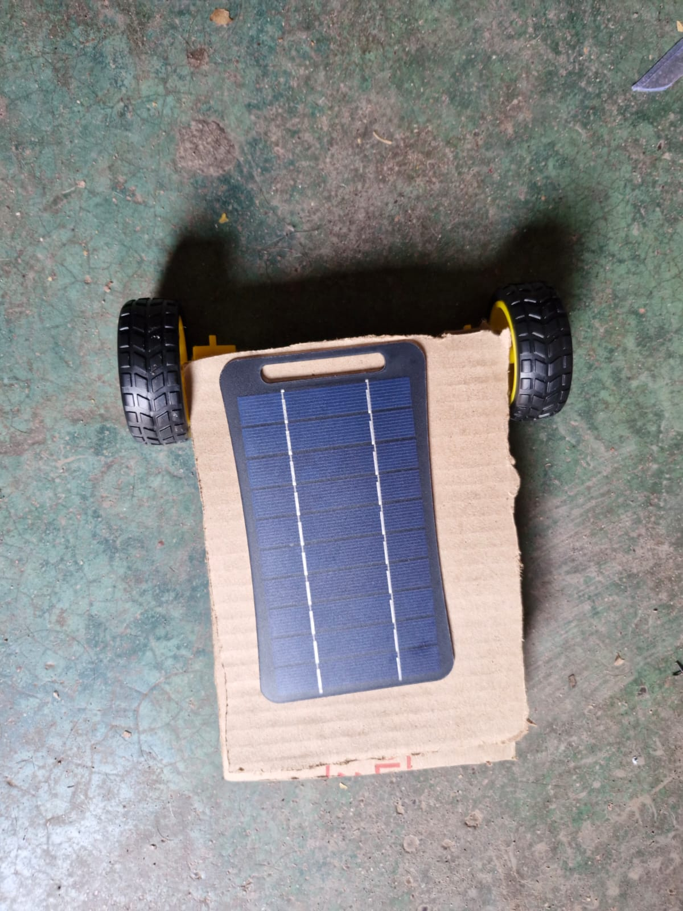

# Nombre del proyecto
FLUJO DE ENERGIA CON CARRO DE PANEL SOLAR

## Descripción
En este proyecto se construyó un carrito impulsado por energía solar utilizando un panel solar, motorreductores con llantas, una rueda loca, cables jumper y una base de cartón. El objetivo fue integrar estos componentes para crear un sistema sencillo de movimiento aprovechando la energía solar.

## Objetivos de aprendizaje
Comprender el funcionamiento básico de un panel solar como fuente de energía.
Identificar la función de los motorreductores, llantas y rueda loca en el movimiento del carrito.
Aprender a realizar conexiones eléctricas básicas utilizando cables jumper.
Desarrollar habilidades para integrar componentes mecánicos y eléctricos en un proyecto funcional.
Comprender de manera práctica el uso de la energía solar para generar movimiento.

## Material utilizado
Enumera todos los componentes usados:
- una base de carton.
- 2 motorreductores con ruedas.
- 1 rueda loca.
- 1 panel solar.
- 1 cable usb tipo A.
- 4 cables jumper.
- pistola de silicon.
- cautin de lapiz.
- cuter.
  

## Video del funcionamiento

[Video](Video/Readme.txt)

[Ver video en YouTube]([https://youtu.be/cl9x-oH7x34](https://youtu.be/cl9x-oH7x34)

## Evidencias de la automatizacion

## Conclusiones
El proyecto permitió aplicar de manera práctica los conocimientos sobre energía solar, conexiones eléctricas y movimiento mecánico, logrando integrar los diferentes componentes para construir un carrito funcional y comprender el aprovechamiento de la energía solar.
## Resultados
[resultados.pdf](Resultados/resultados_carrito_panel_solar.pdf)
