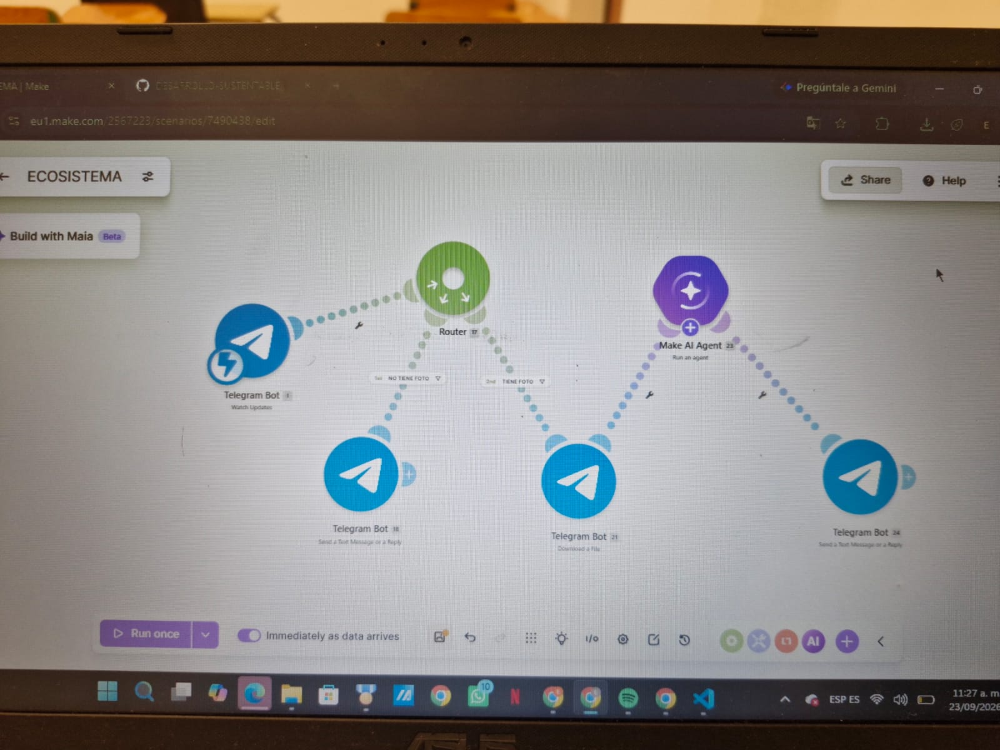
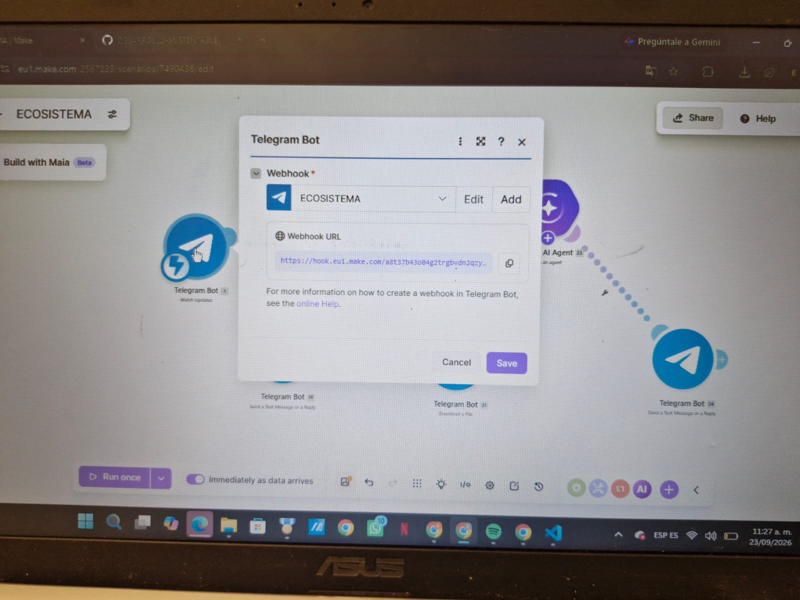
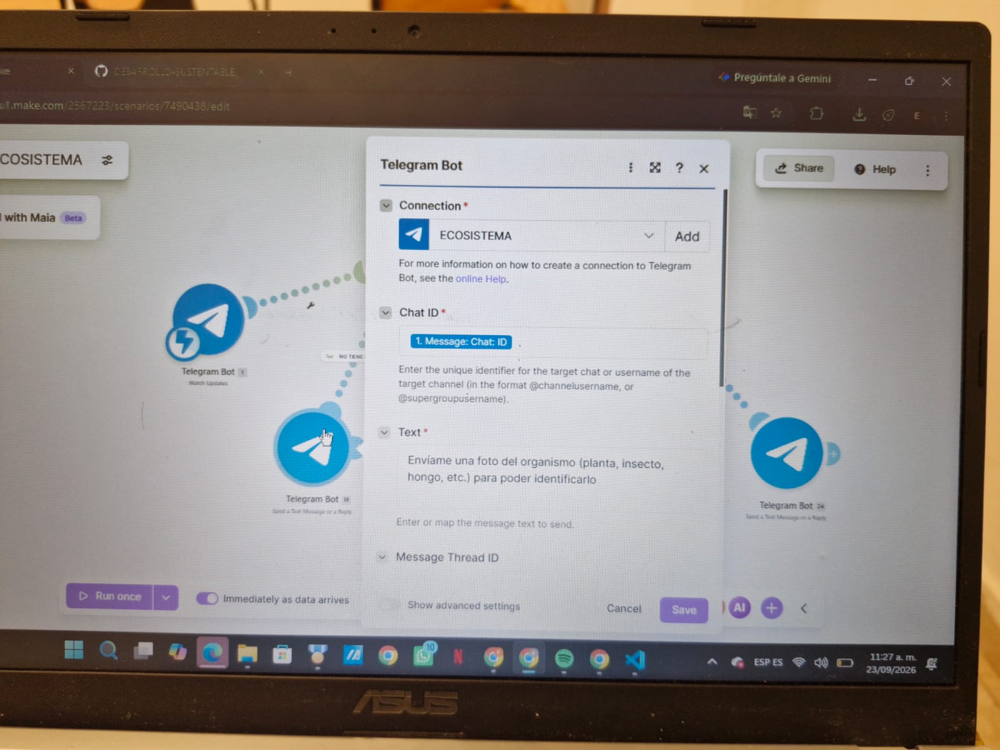
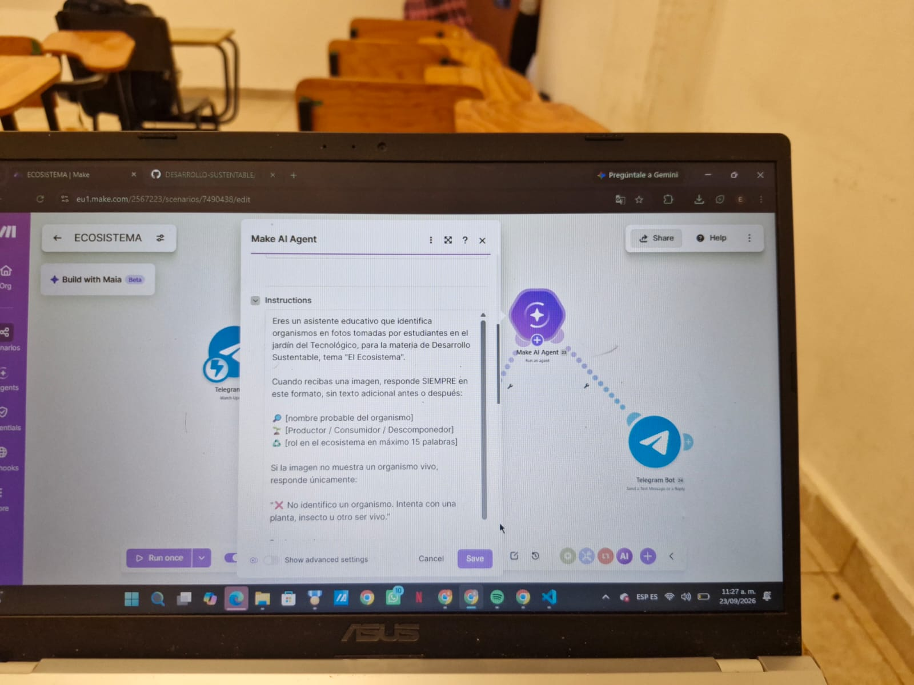
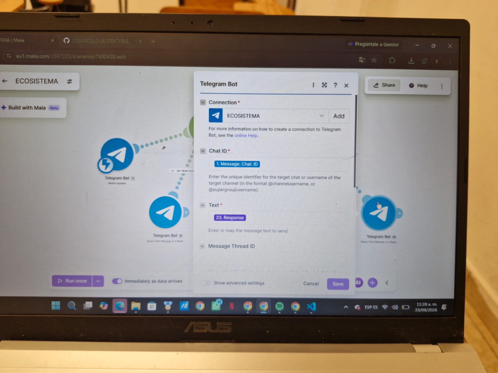

# Nombre del proyecto
ECOSISTEMA

## Descripción
el objetivo de este codigo expone un chatbot en el que recibe imagenes de organismos vivos y las identifica.

## Objetivos de aprendizaje
 expone una automatizacion en make y consiste en recibir imagenes mediante un chatbot de telegram de organismos vivos y utilizando inteligencia artificial para analizarlas e identificarlas.

## Material utilizado
Enumera todos los componentes usados:
- make
- telegram
- telefono
- laptop
- github
  

## Diagrama de la automatizacion

## Código
[ECOSISTEMA.blueprint](Codigo/ECOSISTEMA.blueprint.json)

## Video del funcionamiento

[Video](Video/Readme.txt)

[Ver video en YouTube]([https://youtu.be/cl9x-oH7x34](https://youtu.be/cl9x-oH7x34)

## Evidencias de la automatizacion

## Conclusiones
En conclusión, la automatización “ECOSISTEMA” permite integrar Telegram e inteligencia artificial para facilitar la identificación y clasificación de organismos. Su implementación optimiza el proceso de aprendizaje y demuestra cómo la tecnología puede utilizarse de manera eficiente como apoyo en actividades educativas.

## Resultados
[resultados.pdf](Resultados/resultados.pdf)

