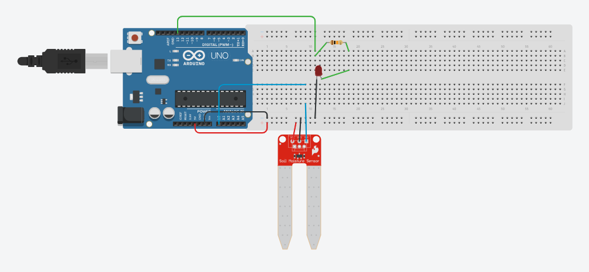
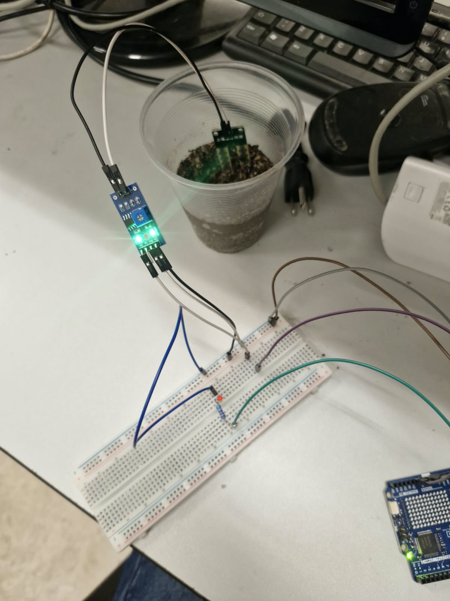
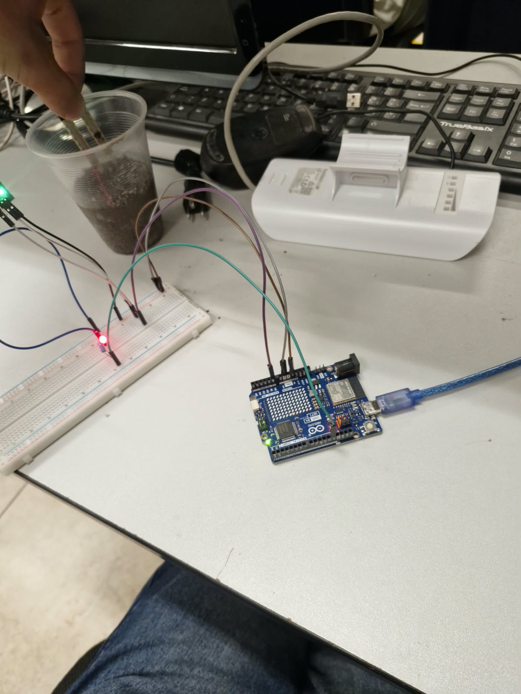
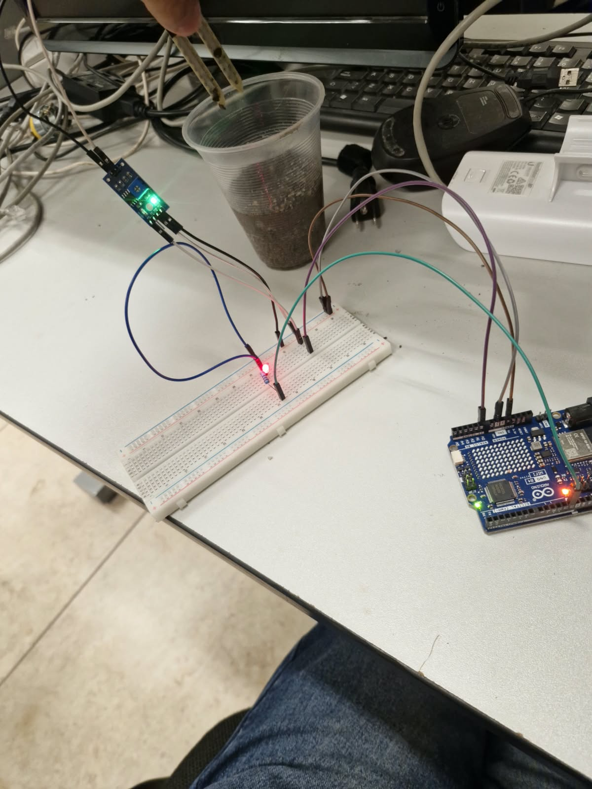
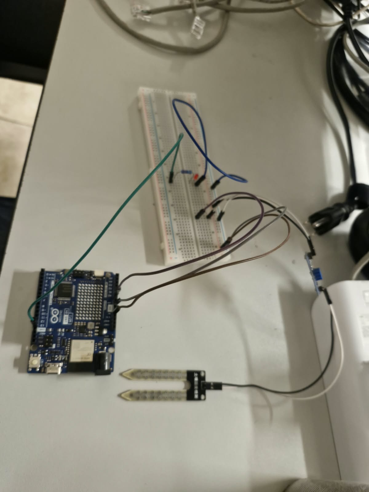
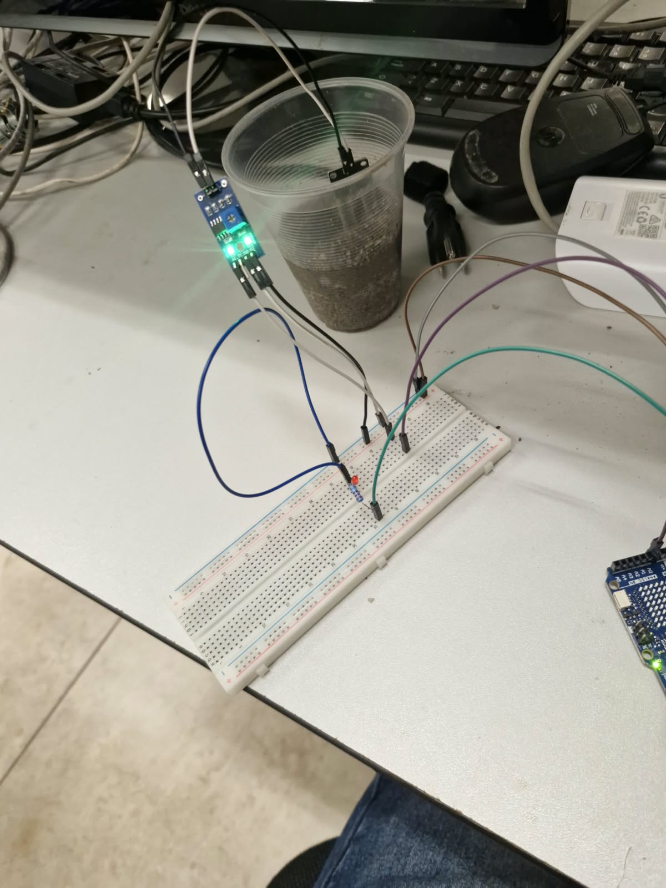
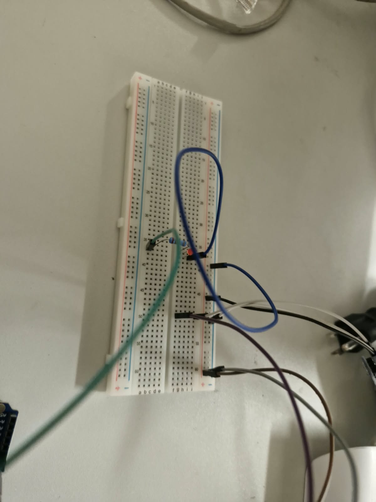
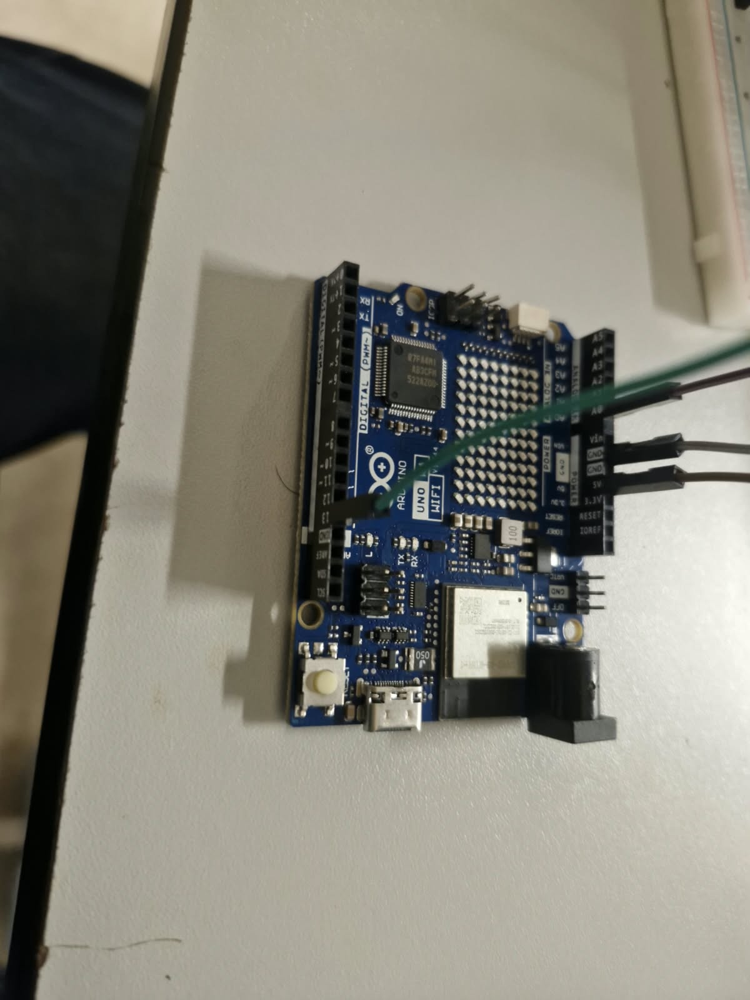

# Nombre del proyecto
LITOSFERA

## Descripción
en este proyecto se conecto un sensor de humedad usando algunos materiales para poder medir la humedad de la tierra.

## Objetivos de aprendizaje
 el objetivo de este proyecto fue poder crear una conexion que pueda por si misma medir la humedad de la tierra y asi avisar si necesita agua o si esta en su estadi de humedad adecuado.

## Material utilizado
Enumera todos los componentes usados:
- protoboard
- cables jumper
- sensor de humedad
- laptop
- arduino uno R4
-1 led rojo
-1 1 recistencia de 220 oms
- 1 vaso con tierra humeda

  

## Diagrama de la automatizacion

## Código
[LITOSFERA.ino](CODIGO/LITOSFERA.ino)

## Video del funcionamiento

[Video](VIDEO/Readme.txt)

[Ver video en YouTube]([https://youtube.com/shorts/h76BdNUndr4](https://youtube.com/shorts/h76BdNUndr4)

## Evidencias de la automatizacion

## Conclusiones
El proyecto de la litósfera permitió comprender de manera práctica la importancia de sus componentes y su relación con el entorno, reforzando los conocimientos sobre el suelo y los procesos que forman parte de nuestro planeta.
## Resultados
[Resultados.pdf](RESULTADOS/Resultados.pdf)

